# Mini-Git Architecture & Design Specification

> **C++17 Command-Line Version Control System & Visual Web Studio**

---

## Table of Contents
1. [Layered Overview](#1-layered-overview)
2. [Class Responsibilities](#2-class-responsibilities)
3. [Relationships & UML Mapping](#3-relationships--uml-mapping)
4. [On-Disk Layout (`.minigit/`)](#4-on-disk-layout-minigit)
5. [Top-Level Control Flow](#5-top-level-control-flow)
6. [Command Flowcharts](#6-command-flowcharts)
   - [init](#61-flowchart-minigit-init)
   - [add](#62-flowchart-minigit-add-path)
   - [commit](#63-flowchart-minigit-commit--m-msg)
   - [status](#64-flowchart-minigit-status)
   - [diff](#65-flowchart-minigit-diff-file)
   - [branch & checkout](#66-flowchart-minigit-branch--checkout)
   - [merge](#67-flowchart-minigit-merge-branch)
7. [Object Graph Evolution](#7-object-graph-evolution)
8. [OOP & C++ Concept Map](#8-oop--c-concept-map)
9. [Second Frontend: Visual Web Studio (`minigit html`)](#9-second-frontend-visual-web-studio-minigit-html)

---

## 1. Layered Overview

Mini-Git is organized into three decoupled layers: **Frontend (CLI & HTML)**, **Backend Facade (`Repository`)**, and **Storage Subsystems (`.minigit/`)**.

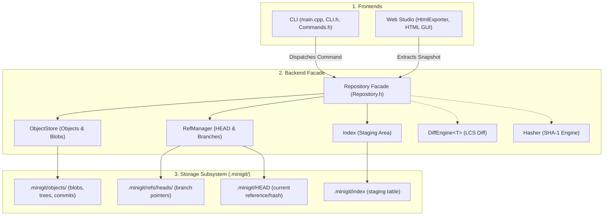

| Layer | Components | Responsibility |
|---|---|---|
| **Frontend** | `main.cpp`, `CLI`, `Command` hierarchy | Parses arguments, prints user output, catches exceptions, coordinates CLI / HTML report. |
| **Backend Facade** | `Repository` | Contains all business logic, never prints to `stdout`/`stderr`, owns storage abstractions. |
| **Storage Subsystems** | `ObjectStore`, `Index`, `RefManager` | Reads and writes immutable objects, staging index, and branch references under `.minigit/`. |

---

## 2. Class Responsibilities

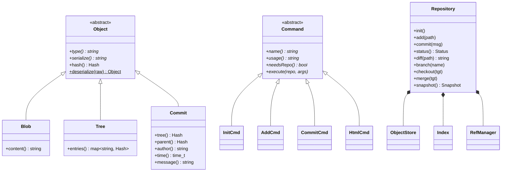

### Core Data & Object Models
- **`Hash`**: Value type wrapping a 40-character hexadecimal SHA-1 digest. Overloads `==`, `!=`, `<`, and `<<`.
- **`Hasher`**: SHA-1 cryptographic engine implementing the Merkle-Damgård construction.
- **`Object`** *(Abstract Base)*: Defines `type()`, `serialize()`, `hash()`, and factory `deserialize()`.
  - **`Blob`**: Stores raw uncompressed file contents.
  - **`Tree`**: Maps relative file paths to `Hash` identifiers (`map<string, Hash>`), representing snapshot directories.
  - **`Commit`**: Encapsulates a root `Tree` hash, parent commit `Hash`, author string, timestamp, and log message.

### Engine Services
- **`ObjectStore`**: Content-addressable object store located at `.minigit/objects/`. Implements template method `loadAs<T>()` and prefix resolver `resolvePrefix()` for short hashes.
- **`Index`**: Staging area manager mapping relative paths to staged blob hashes; synchronizes with `.minigit/index`.
- **`RefManager`**: Manages `.minigit/HEAD` and `.minigit/refs/heads/` (supporting attached branches and detached HEAD).
- **`DiffEngine<T>`** *(Template)*: Computes Longest Common Subsequence (LCS) line diffs, producing `DiffOp` operations (`Keep`, `Add`, `Remove`).
- **`Repository`**: Central facade pattern mediating all version control operations.
- **`Status`**: Struct packaging lists of `staged`, `modified`, `deleted`, and `untracked` paths.
- **`Snapshot`**: Complete read-only memory capture of repository state (objects, branches, working files, index).
- **`HtmlExporter`**: Converts a `Snapshot` into JSON and injects it into the self-contained Liquid Glass web dashboard.

### Commands & Dispatcher
- **`Command`** *(Abstract Base)*: Declares `name()`, `usage()`, `needsRepo()`, and `execute(repo, args)`.
- **`CLI`**: Registry storing `map<string, unique_ptr<Command>>` dispatching command execution.
- **`MiniGitException`** *(Exception Base)*: Provides `virtual category()` caught uniformly by `CLI::run`.

---

## 3. Relationships & UML Mapping

- **Inheritance**:
  - `Blob`, `Tree`, `Commit` $\rightarrow$ `Object`
  - Concrete commands (`InitCmd`, `AddCmd`, `CommitCmd`, `LogCmd`, `StatusCmd`, `DiffCmd`, `BranchCmd`, `CheckoutCmd`, `MergeCmd`, `HtmlCmd`) $\rightarrow$ `Command`
  - Custom exceptions (`NotARepoException`, `FileNotFoundException`, `BranchException`, `NothingToCommitException`, `CheckoutException`, `MergeException`) $\rightarrow$ `MiniGitException` $\rightarrow$ `std::runtime_error`
- **Composition**:
  - `Repository` owns `ObjectStore`, `Index`, `RefManager`
  - `CLI` owns `map<string, unique_ptr<Command>>`
- **Association**:
  - `Tree` associates with `Hash` (blob identifiers)
  - `Commit` associates with `Hash` (tree & parent commit)
  - `Index` associates with `Hash` (staged blob IDs)
- **Dependency**:
  - `Repository` $\rightarrow$ `DiffEngine<string>`, `Blob`, `Tree`, `Commit`, `Snapshot`
  - `HtmlCmd` $\rightarrow$ `HtmlExporter`, `Repository`, `Snapshot`
  - `ObjectStore` $\rightarrow$ `Object` (instantiates through `Object::deserialize`)

---

## 4. On-Disk Layout (`.minigit/`)

```text
.minigit/
├── HEAD                 "ref: refs/heads/main"  (or raw hash when detached)
├── index                "<blobhash> <filepath>" (one line per staged entry)
├── refs/
│   └── heads/
│       ├── main         latest 40-char commit hash on 'main'
│       └── feature      latest 40-char commit hash on 'feature'
└── objects/
    ├── 7f59f3...        Blob:   "blob\n<raw file content>"
    ├── a91c02...        Tree:   "tree\n<blobhash> <filepath>\n..."
    └── e1dfc6...        Commit: "commit\ntree <treehash>\nparent <parenthash>\nauthor ...\n\n<message>"
```

> [!NOTE]
> Every object is addressed by the SHA-1 hash of its header and body: `SHA-1(type + "\n" + content)`.

---

## 5. Top-Level Control Flow

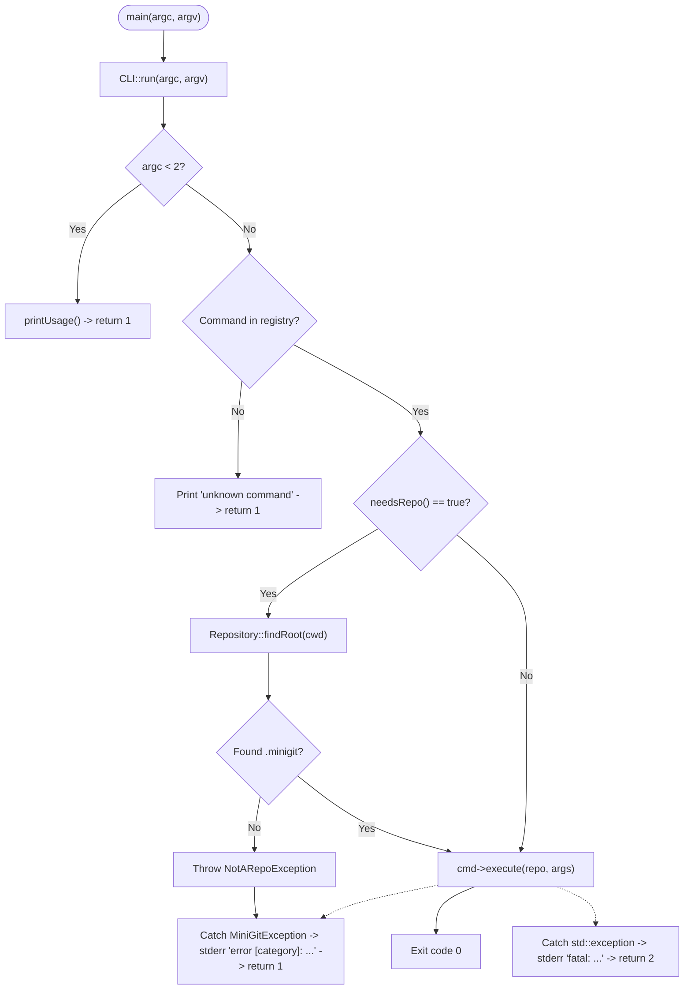

---

## 6. Command Flowcharts

### 6.1 Flowchart: `minigit init`

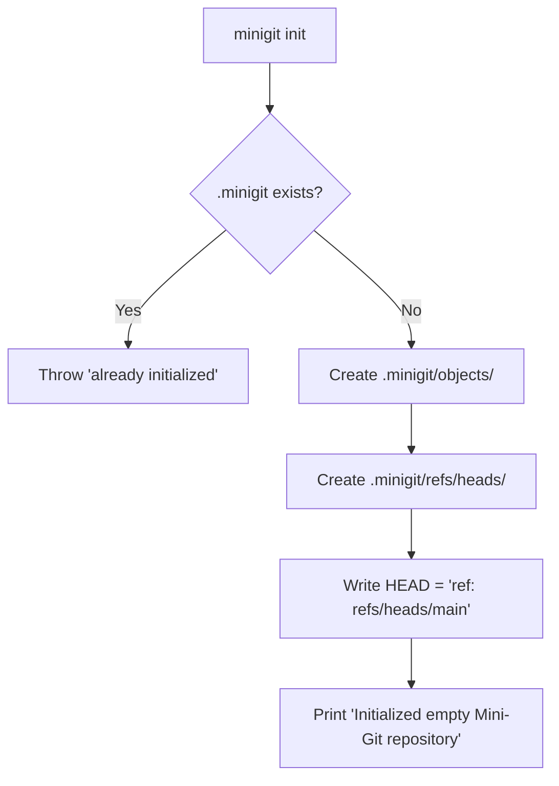

---

### 6.2 Flowchart: `minigit add <path>`

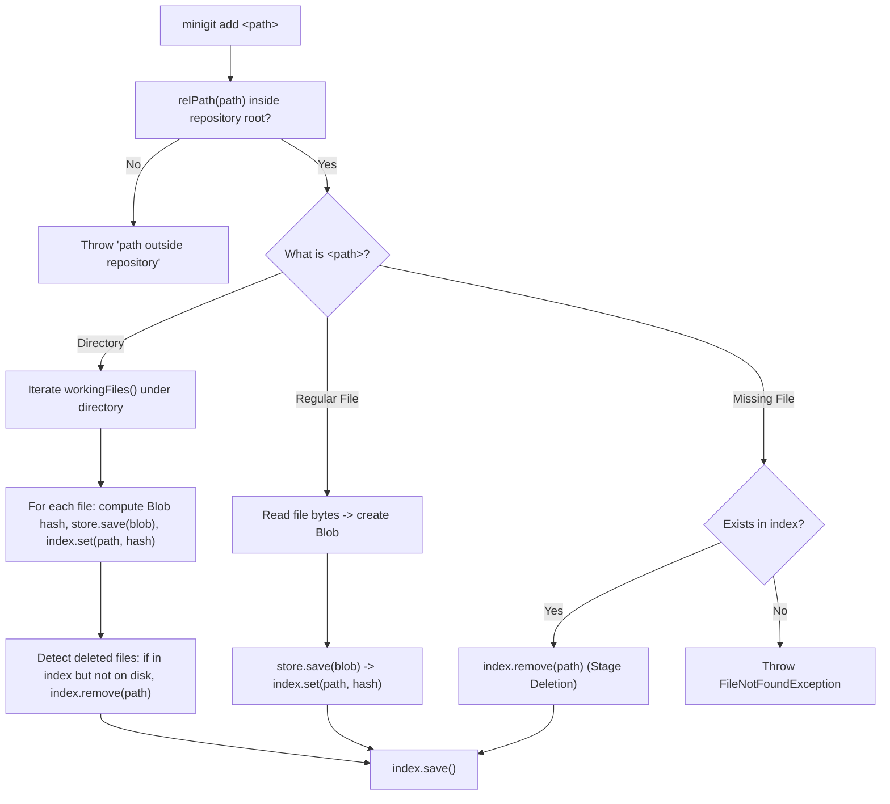

---

### 6.3 Flowchart: `minigit commit -m "msg"`

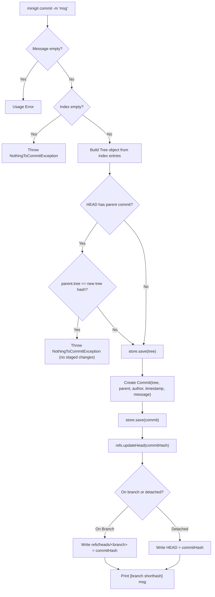

---

### 6.4 Flowchart: `minigit status`

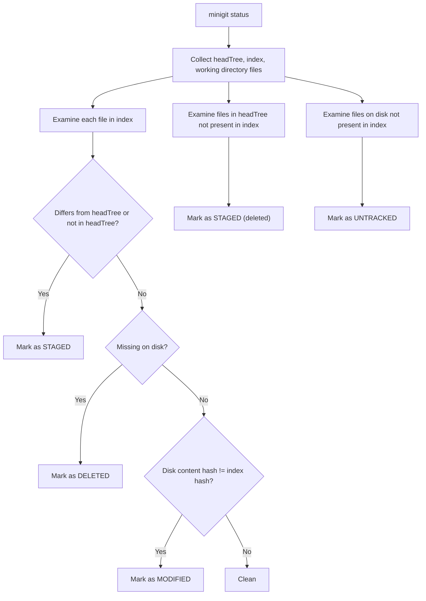

---

### 6.5 Flowchart: `minigit diff [file]`

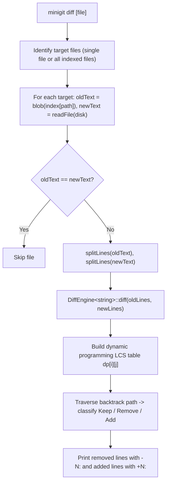

---

### 6.6 Flowchart: `minigit branch` & `checkout`

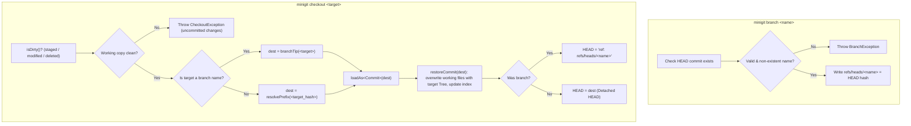

---

### 6.7 Flowchart: `minigit merge <branch>`

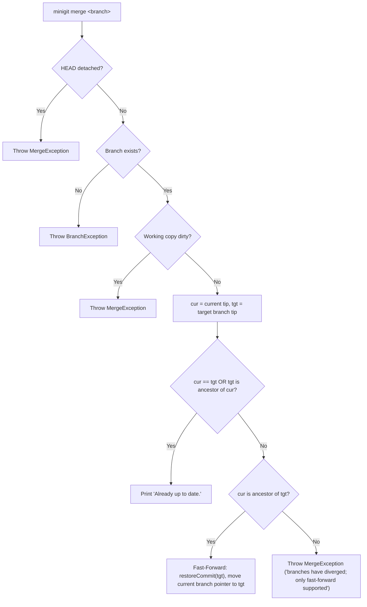

---

## 7. Object Graph Evolution

Commit trees represent full snapshots. Unchanged files reuse existing blob hashes:

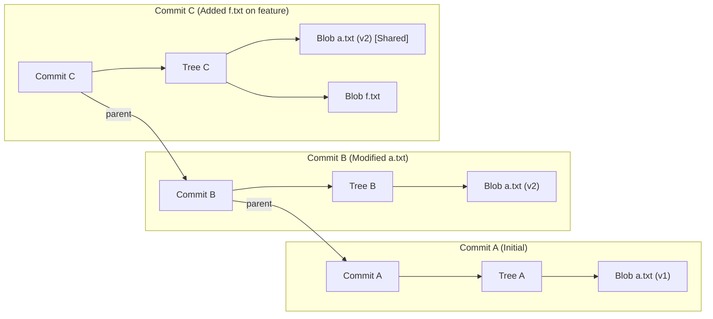

---

## 8. OOP & C++ Concept Map

| Concept | Implementation in Mini-Git |
|---|---|
| **Encapsulation** | Strict private members with accessors in `Commit`, `Hash`, `Index`, `RefManager`, and `Repository`. |
| **Inheritance** | Polymorphic hierarchies: `Object` (`Blob`, `Tree`, `Commit`), `Command` (10 concrete commands), and `MiniGitException`. |
| **Polymorphism** | Dynamic dispatch via pure virtual methods (`execute()`, `serialize()`, `type()`, `category()`). |
| **Abstract Classes** | `Object` and `Command` enforce interface contracts via pure virtual methods (`= 0`). |
| **Templates** | Generic LCS algorithm `DiffEngine<T>` and type-safe object loading `ObjectStore::loadAs<T>()`. |
| **Exception Safety** | Structured error propagation throwing domain exceptions in the backend, caught once in `CLI::run`. |
| **Operator Overloading** | Canonical relational operators (`==`, `!=`, `<`) on `Hash` and stream output `<<` for `Hash` and `Commit`. |
| **Modern Memory Management** | Zero raw pointers/manual deletions; strict RAII utilizing `std::unique_ptr` throughout. |
| **Modern File I/O** | Portable filesystem manipulation using `std::filesystem` and robust stream utilities. |
| **Design Patterns** | **Command Pattern** (`CLI` & `Command`), **Facade Pattern** (`Repository`), and **Factory Pattern** (`Object::deserialize`). |

---

## 9. Second Frontend: Visual Web Studio (`minigit html`)

Mini-Git provides two frontends sharing the same backend:

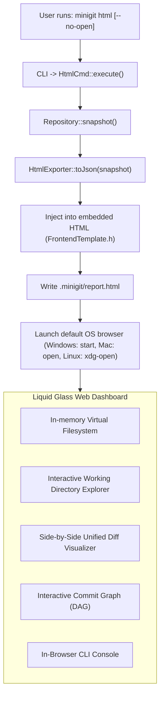

- **Live Snapshot**: The export writes directly inside `.minigit/report.html`, ensuring it never appears as an untracked file in the repository.
- **Apple Liquid Glass Interface**: Styled with frosted glass layers (`backdrop-blur-28px`), tactile segmented pill switchers, and an atmospheric sky backdrop.
- **Client-Side SHA-1 Verification**: File statuses are verified in the browser using the Web Crypto API, matching the C++ backend.
