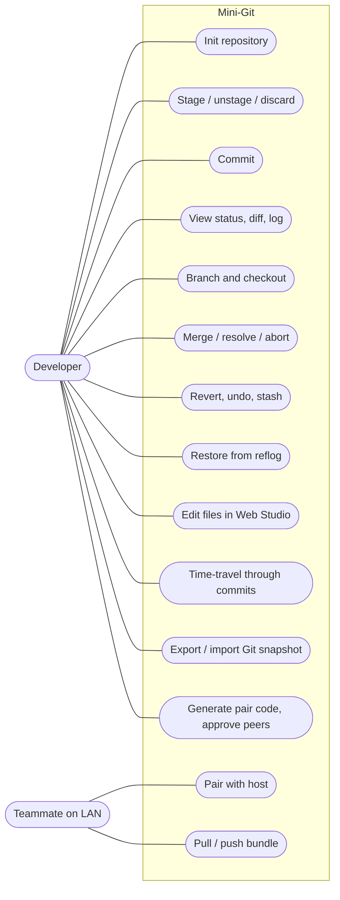

# Use-Case Diagram

What the developer and a LAN teammate can do with Mini-Git.

```mermaid
flowchart LR
    Dev(["Developer"])
    Mate(["Teammate on LAN"])
    subgraph SYS["Mini-Git"]
        direction TB
        UC1(["Init repository"])
        UC2(["Stage / unstage / discard"])
        UC3(["Commit"])
        UC4(["View status, diff, log"])
        UC5(["Branch and checkout"])
        UC6(["Merge / resolve / abort"])
        UC7(["Revert, undo, stash"])
        UC8(["Restore from reflog"])
        UC9(["Edit files in Web Studio"])
        UC10(["Time-travel through commits"])
        UC11(["Export / import Git snapshot"])
        UC12(["Generate pair code, approve peers"])
        UC13(["Pair with host"])
        UC14(["Pull / push bundle"])
    end
    Dev --- UC1 & UC2 & UC3 & UC4 & UC5 & UC6 & UC7 & UC8 & UC9 & UC10 & UC11 & UC12
    Mate --- UC13 & UC14
```

Image version: [png/use-case.png](png/use-case.png)

[Back to all diagrams](README.md)
